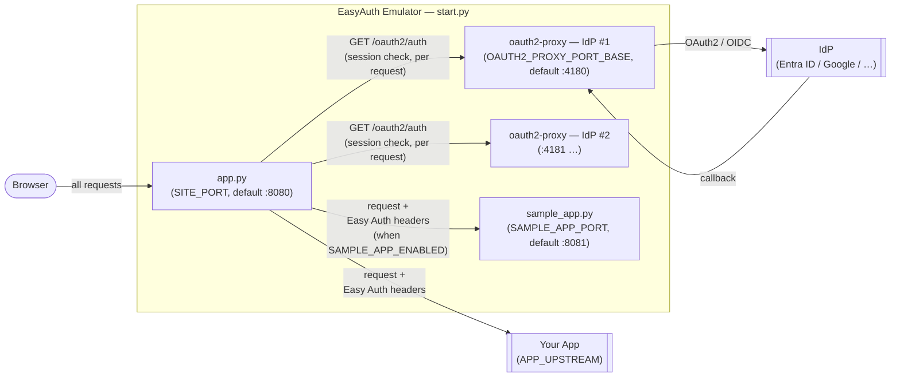

# Contributing

## Architecture

### Component overview

`start.py` is the entry point. It launches and supervises three kinds of processes:



`app.py` is the sole public HTTP endpoint. The oauth2-proxy instances are internal and never receive requests directly from the browser.

### Easy Auth headers injected by app.py

| Header | Source |
| --- | --- |
| `X-Forwarded-User` | `X-Auth-Request-User` from oauth2-proxy |
| `X-Forwarded-Email` | `X-Auth-Request-Email` from oauth2-proxy |
| `X-MS-CLIENT-PRINCIPAL-NAME` | email or user from oauth2-proxy |
| `X-MS-TOKEN-AAD-ACCESS-TOKEN` | `X-Auth-Request-Access-Token` from oauth2-proxy |
| `X-MS-TOKEN-AAD-ID-TOKEN` | `X-Auth-Request-Id-Token` from oauth2-proxy |
| `X-MS-CLIENT-PRINCIPAL` | base64(JSON) built from decoded ID token JWT claims |
| `X-MS-CLIENT-PRINCIPAL-ID` | user or email |

---

## Binary Build Policy

Official distributable binaries are built and published by GitHub Actions.

- Do not treat locally built binaries as release artifacts.
- Use CI-produced artifacts for distribution and release workflows.

## Local Development Testing

### Browser

When testing the emulator locally, use an external browser (Chrome, Edge, Firefox, Safari).

VS Code's built-in **Simple Browser** does not work with OAuth2 flows — its WebView has limited Cookie support, which causes a blank page after the authentication callback.

### Prerequisites

- Python 3.11+
- PyInstaller installed in your environment

### Command

Use `scripts/package.py` to verify that your changes produce a working binary before pushing to CI.
Runs PyInstaller and produces a local archive. Supports Windows (`.zip`), macOS, and Linux (`.tar.gz`).

- **Windows**: amd64 only. arm64 is not supported (oauth2-proxy does not distribute Windows ARM binaries).
- **Cross-compilation**: not supported. Run this script on the OS and architecture you are targeting.

```powershell
python scripts/package.py
```

To skip the PyInstaller build and repackage an existing `dist/` output:

```powershell
python scripts/package.py --skip-build
```

### Python Tests

Install dependencies into this project's own `.venv`, not your global/system Python — installing
`requirements-test.txt` globally can upgrade shared packages (`protobuf`, `grpcio`) and break
unrelated projects on your machine.

```powershell
python -m venv .venv
.venv\Scripts\pip install -r requirements.txt -r requirements-test.txt
```

Run the suite:

```powershell
.venv\Scripts\python -m pytest tests/python/ -v
```

---

## Debug the Core Emulator (F5)

The `Debug Emulator` launch configuration (`.vscode/launch.json`) runs `start.py` directly in the VS Code debugger. Use this to verify core emulator behavior without the extension.

**Prerequisites:**

Create `config.toml` in the project root (copy from `config.toml.example` and fill in your values).

**Steps:**

1. Open the repository root in VS Code.
2. In the Run and Debug panel, select **Debug Emulator** from the configuration dropdown.
3. Press `F5`.

---

## Verification App (sample_app)

`src/sample_app.py` is an optional verification app that displays the authenticated user's claims and tests delegated Azure Blob Storage access. Use it to confirm that the emulator is injecting Easy Auth-compatible headers correctly. It also has a `/protocol` page for testing WebSocket/SSE/chunked-request-body behavior through the gateway — see `tests/protocol/README.md` for the same demo with gRPC added too (dev-only, not shipped with the emulator's binary).

### Enable

Add the following to `config.toml`:

```toml
SAMPLE_APP_ENABLED = true
APP_UPSTREAM = http://localhost:8081   # route emulator traffic to sample_app
```

Start the emulator as usual — `sample_app` starts alongside it.

### Blob Storage access (optional)

Set the target blob URL in `config.toml`:

```toml
SAMPLE_APP_STORAGE_BLOB_URL = https://<account>.blob.core.windows.net/<container>/<blob>
```

sample_app supports two token flows, selectable via the `storage_flow` query parameter (examples: `http://localhost:8080/?storage_flow=direct`, `http://localhost:8080/?storage_flow=obo`):

**`?storage_flow=direct` (default) — use the forwarded access token directly**

sample_app sends the forwarded `X-MS-TOKEN-AAD-ACCESS-TOKEN` directly to Azure Storage without an OBO exchange. Requires the token's audience to be Azure Storage.

In your Entra ID app registration, add the delegated permission **Azure Storage → user_impersonation**, then add `https://storage.azure.com/user_impersonation` to `IDP_ENTRA_SCOPES` in `config.toml`:

```toml
IDP_ENTRA_SCOPES = openid profile email https://storage.azure.com/user_impersonation
```

**`?storage_flow=obo` — On-Behalf-Of exchange**

sample_app exchanges the forwarded access token for a Storage-scoped token via OBO. Use this when your app exposes its own API scope and the token's audience is your app rather than Azure Storage.

In your Entra ID app registration, go to **Expose an API** and add a scope (for example `access_as_user`). The scope URI will be in the form `api://<client-id>/<scope-name>`. Add it to `IDP_ENTRA_SCOPES` in `config.toml`:

```toml
IDP_ENTRA_SCOPES = openid profile email api://<client-id>/<scope-name>
```

| Parameter | Default | Description |
| --- | --- | --- |
| `SAMPLE_APP_STORAGE_BLOB_URL` | — | Azure Blob Storage URL to access |
| `SAMPLE_APP_OBO_STORAGE_SCOPE` | `https://storage.azure.com/.default` | OBO scope for the storage token request |
| `SAMPLE_APP_STORAGE_TIMEOUT_SECONDS` | `10` | Storage request timeout in seconds |
| `SAMPLE_APP_STORAGE_PREVIEW_BYTES` | `4096` | Number of bytes to preview from the storage response |

---

## VS Code Extension Build

**Requirements:** Node.js 24 or later, npm.

### Run in Extension Development Host (F5)

The `Debug Extension` launch configuration (`.vscode/launch.json`) opens an Extension Development Host with the extension loaded, and optionally opens a test App Service project in that host window.

**Prerequisites:**

Install npm dependencies (first time only):

```powershell
cd vscode-extension
npm install
```

**Environment variable (optional):**

Set `EASYAUTH_EXTENSION_TEST_PROJECT_DIR` to the absolute path of an App Service project on your machine. If set, the Extension Development Host will open that folder automatically, making it easy to test the extension against a real project.

If the variable is not set, the Extension Development Host opens without a folder.

**Steps:**

1. Open the repository root in VS Code.
2. In the Run and Debug panel, select **Debug Extension** from the configuration dropdown.
3. Press `F5` to launch the Extension Development Host.

### Run Extension Tests

**Via CLI:**

```powershell
cd vscode-extension
npm test
```

Compiles the extension with esbuild and the test files with `tsc`, then runs all tests in a VS Code Extension Host instance.

**Via F5:**

The `Extension Tests` launch configuration (`.vscode/launch.json`) builds the emulator binary, bundles the extension, compiles the test files, and runs the Mocha test suite inside a VS Code Extension Host.

1. Open the repository root in VS Code.
2. In the Run and Debug panel, select **Extension Tests** from the configuration dropdown.
3. Press `F5`.

### Package as VSIX (local verification only)

The VSIX bundles the emulator binary. Use `--vsix` to build both in one step:

```powershell
python scripts/package.py --vsix
```

This runs PyInstaller, creates the distributable archive, and packages the VSIX.
To skip the PyInstaller step when the binary is already in `dist/`:

```powershell
python scripts/package.py --skip-build --vsix
```

This produces `easyauth-emulator-<version>-win32-x64.vsix` in `vscode-extension/`.

### README Diagram Images

The diagram images in the extension README are generated from SVG source files. Edit the SVG first, then regenerate the PNGs with [ImageMagick](https://imagemagick.org/). Run commands from the repository root.

```powershell
magick -background white vscode-extension/images/flow.svg    -resize 740x -flatten vscode-extension/images/flow.png
magick -background white vscode-extension/images/flow_ja.svg -resize 780x -flatten vscode-extension/images/flow_ja.png
```

---

## Icon Assets

The source icon is `assets/icon.svg`. Use [ImageMagick](https://imagemagick.org/) to regenerate the derived files. Run all commands from the repository root.

**exe icon** (`assets/icon.ico`):

```powershell
magick -background none assets/icon.svg -resize 512x512 -gravity center -extent 512x512 assets/icon.png
magick assets/icon.png -define icon:auto-resize=256,128,64,48,32,24,16 assets/icon.ico
```

**VS Code extension icon** (`vscode-extension/images/icon.png`):

```powershell
magick -background none assets/icon.svg -resize 256x256 -gravity center -extent 256x256 vscode-extension/images/icon.png
```
