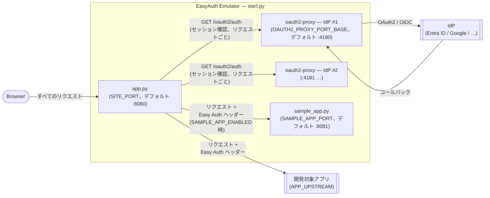

# コントリビューション

## アーキテクチャ

### コンポーネント概要

`start.py` はエントリポイントです。以下の 3 種類のプロセスを起動・管理します。



`app.py` が唯一の公開 HTTP エンドポイントです。oauth2-proxy インスタンスは内部専用であり、ブラウザから直接リクエストを受け取りません。

### app.py が注入する Easy Auth ヘッダー

| ヘッダー | 生成元 |
| --- | --- |
| `X-Forwarded-User` | oauth2-proxy からの `X-Auth-Request-User` |
| `X-Forwarded-Email` | oauth2-proxy からの `X-Auth-Request-Email` |
| `X-MS-CLIENT-PRINCIPAL-NAME` | oauth2-proxy からの email または user |
| `X-MS-TOKEN-AAD-ACCESS-TOKEN` | oauth2-proxy からの `X-Auth-Request-Access-Token` |
| `X-MS-TOKEN-AAD-ID-TOKEN` | oauth2-proxy からの `X-Auth-Request-Id-Token` |
| `X-MS-CLIENT-PRINCIPAL` | ID トークン JWT クレームから生成した base64(JSON) |
| `X-MS-CLIENT-PRINCIPAL-ID` | user または email |

---

## バイナリビルドポリシー

配布可能な公式バイナリは GitHub Actions によってビルド・公開されます。

- ローカルビルドのバイナリをリリース成果物として扱わないでください。
- 配布・リリースワークフローには CI が生成した成果物を使用してください。

## ローカル開発テスト

### ブラウザ

エミュレーターをローカルでテストする際は、外部ブラウザ（Chrome、Edge、Firefox）を使用してください。

VS Code 組み込みの **Simple Browser** は OAuth2 フローに対応していません。WebView の Cookie サポートが限定的なため、認証コールバック後に空白ページが表示されます。

ローカルバイナリビルドは開発確認用途のみです。

### 前提条件

- Python 3.11 以上
- PyInstaller がインストール済みであること

### コマンド

`scripts/package.py` を使用すると、PyInstaller の実行から配布用アーカイブの作成まで一括で行えます。
Windows（`.zip`）、macOS・Linux（`.tar.gz`）および `amd64` / `arm64` / `arm` アーキテクチャに対応しています。

```powershell
python scripts/package.py
```

既存の `dist/` 出力を再パッケージする場合（PyInstaller ビルドをスキップ）:

```powershell
python scripts/package.py --skip-build
```

### 注意事項

- このスクリプトは開発確認用途のみです。
- 配布バイナリは必ず GitHub Actions の成果物を使用してください。

---

## エミュレーター本体のデバッグ（F5）

`.vscode/launch.json` の `Debug Emulator` 起動構成を使うと、`start.py` を VS Code デバッガーで直接実行できます。拡張機能を介さずにエミュレーター本体の動作を確認する場合に使用します。

**前提条件:**

プロジェクトルートに `config.toml` を作成してください（`config.toml.example` をコピーして値を入力）。

**手順:**

1. VS Code でリポジトリルートを開きます。
2. `F5` を押す（または「実行とデバッグ」パネルから **Debug Emulator** を選択）。

---

## 動作確認用アプリ（sample_app）

`src/sample_app.py` は、認証済みユーザーの claim を表示し、Azure Blob Storage への委任アクセスをテストするオプションの動作確認用アプリです。エミュレーターが Easy Auth 互換ヘッダーを正しく注入しているか確認するために使用します。

### 有効化

`config.toml` に以下を追加します:

```toml
SAMPLE_APP_ENABLED = true
APP_UPSTREAM = http://localhost:8081   # エミュレーターのトラフィックを sample_app へ転送
```

通常どおりエミュレーターを起動すると、sample_app も同時に起動します。

### Blob Storage アクセス（オプション）

対象 blob の URL を `config.toml` に設定します:

```toml
SAMPLE_APP_STORAGE_BLOB_URL = https://<account>.blob.core.windows.net/<container>/<blob>
```

sample_app は `storage_flow` クエリパラメーターでトークンフローを切り替えられます（例: `http://localhost:8080/?storage_flow=direct`、`http://localhost:8080/?storage_flow=obo`）:

**`?storage_flow=direct`（デフォルト）— 転送されたアクセストークンをそのまま使用**

OBO 交換を行わず、`X-MS-TOKEN-AAD-ACCESS-TOKEN` を直接 Azure Storage に送信します。トークンの audience が Azure Storage である必要があります。

Entra ID のアプリ登録で委任アクセス許可 **Azure Storage → user_impersonation** を追加し、`https://storage.azure.com/user_impersonation` を `config.toml` の `IDP_ENTRA_SCOPES` に追加します:

```toml
IDP_ENTRA_SCOPES = openid profile email https://storage.azure.com/user_impersonation
```

**`?storage_flow=obo` — On-Behalf-Of 交換**

転送されたアクセストークンを OBO で Storage スコープのトークンに交換します。自アプリが独自の API スコープを公開していて、トークンの audience が Azure Storage ではなく自アプリになっている場合に使用します。

Entra ID のアプリ登録で **「API の公開」** にスコープを追加します（例: `access_as_user`）。スコープ URI は `api://<client-id>/<scope-name>` の形式になります。このスコープを `config.toml` の `IDP_ENTRA_SCOPES` に追加します:

```toml
IDP_ENTRA_SCOPES = openid profile email api://<client-id>/<scope-name>
```

| パラメーター | 既定値 | 説明 |
| --- | --- | --- |
| `SAMPLE_APP_STORAGE_BLOB_URL` | — | アクセス先の Azure Blob Storage URL |
| `SAMPLE_APP_OBO_STORAGE_SCOPE` | `https://storage.azure.com/.default` | ストレージトークンリクエスト時の OBO スコープ |
| `SAMPLE_APP_STORAGE_TIMEOUT_SECONDS` | `10` | ストレージリクエストのタイムアウト秒数 |
| `SAMPLE_APP_STORAGE_PREVIEW_BYTES` | `4096` | ストレージレスポンスのプレビューバイト数 |

---

## VS Code 拡張機能ビルド

**要件:** Node.js 18 以上、npm。

### TypeScript のコンパイル

```powershell
cd vscode-extension
npm install
npm run compile
```

出力は `vscode-extension/out/` に書き込まれます。

開発中に変更を監視する場合:

```powershell
npm run watch
```

### 拡張機能開発ホストで実行（F5）

`.vscode/launch.json` の `Debug Extension` 起動構成を使用すると、拡張機能を読み込んだ拡張機能開発ホストが起動し、テスト用の App Service プロジェクトをそのホストウィンドウで開くことができます。

**環境変数（省略可能）:**

`EASYAUTH_EXTENSION_TEST_PROJECT_DIR` にマシン上の App Service プロジェクトの絶対パスを設定します。設定すると、拡張機能開発ホストが自動的にそのフォルダーを開き、実プロジェクトに対して拡張機能をテストしやすくなります。

設定しない場合、拡張機能開発ホストはフォルダーなしで起動します。

**手順:**

1. VS Code でリポジトリルートを開きます。
2. `F5` を押す（または「実行とデバッグ」パネルから **Debug Extension** を選択）と、拡張機能開発ホストが起動します。

### VSIX としてパッケージ化（配布用）

VSIX にはエミュレーターバイナリが同梱されるため、先にバイナリをビルドします:

```powershell
python scripts/package.py
```

次に拡張機能をパッケージ化します:

```powershell
cd vscode-extension
npm install
npm run package
```

`easyauth-emulator-<version>-win32-x64.vsix` が生成されます。

`npm run package` スクリプトが `../dist/easyauth-emulator/` からバイナリを VSIX に自動コピーします。

### ビルドノート

- `node_modules/` および `out/` はコミットしないでください（いずれも `.gitignore` に含まれています）。
- 公式 VSIX 成果物は GitHub Actions によってビルドされます。ローカルビルドのパッケージをリリース成果物として扱わないでください。
