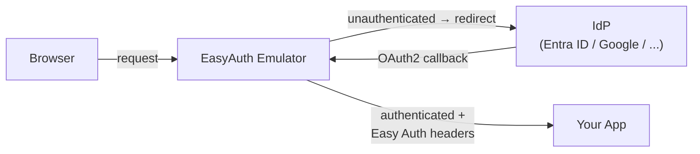

# EasyAuth Emulator

Easy Auth Emulator is an authentication gateway that replaces Azure App Service / Azure Functions / Azure Container Apps authentication for local and development environments. It emulates Authentication and Authorization ("Easy Auth-like") behavior, including multi-provider authentication, Easy Auth-compatible headers, and related endpoints.

## Why?

Azure App Service, Azure Functions, and Azure Container Apps' built-in authentication feature (commonly known as Easy Auth) is powerful, but it is only available within Azure. This makes local development and testing difficult for applications that rely on Easy Auth headers and endpoints.

Easy Auth Emulator bridges that gap by providing an Azure authentication replacement gateway for local and development use.

## Features

- Multi-IDP authentication (Microsoft Entra ID, Google, GitHub, Apple, Facebook, OIDC)
- Easy Auth-compatible request headers
- Local and development environment support
- Designed for Azure App Service, Azure Functions, Azure Container Apps, and Azure Static Web Apps compatibility (Static Web Apps: partial)

## Usage Modes

| Mode | Best for |
| --- | --- |
| **Standalone** ([binary from GitHub Releases](../../releases)) | CI / Docker / non-VS Code environments |
| **VS Code Extension** | VS Code local development (auto-start/stop with debug sessions) |

→ [Standalone setup](#setup) / [VS Code Extension](https://marketplace.visualstudio.com/items?itemName=pnop.easyauth-emulator)

## Typical Use Case



Develop locally with an authentication model compatible with production Azure App Service, Azure Functions, Azure Container Apps, and Azure Static Web Apps (partial) environments.

## Implemented Endpoints

- `GET /.auth/me`
- `GET /.auth/login`
- `GET /.auth/login/<idp>`
  - e.g. `GET /.auth/login/aad`
- `GET /.auth/logout`
- `GET /.auth/refresh` _(stub implementation — returns 200 if authenticated, 401 if not; no token refresh is performed)_
- `GET /.auth/login/select` _(emulator only — not part of Azure Easy Auth)_

Any `/.auth/*` endpoint not listed above returns 404.

## Injected Headers

Headers forwarded to the application after authentication:

- `X-MS-CLIENT-PRINCIPAL`
- `X-MS-CLIENT-PRINCIPAL-ID`
- `X-MS-CLIENT-PRINCIPAL-IDP`
- `X-MS-CLIENT-PRINCIPAL-NAME`
- `X-MS-TOKEN-AAD-ACCESS-TOKEN`
- `X-MS-TOKEN-AAD-ID-TOKEN`
- `X-Forwarded-User`
- `X-Forwarded-Email`

Not yet implemented: `X-MS-TOKEN-AAD-EXPIRES-ON`, `X-MS-TOKEN-AAD-REFRESH-TOKEN`.

## Directory Layout

```text
start.py               # Startup script (source only)
config.toml.example    # Configuration template
config.toml            # Your configuration (copy from config.toml.example)
src/
  app.py               # HTTP gateway and auth app
  sample_app.py        # Optional verification app
bin/
  oauth2-proxy/
    oauth2-proxy[.exe] # oauth2-proxy binary (auto-downloaded on first run)
scripts/
  package.py           # Build script for unsupported platforms
vscode-extension/      # VS Code extension (TypeScript)
docs/
  configuration-reference.md     # Full configuration reference (English)
  configuration-reference_ja.md  # Full configuration reference (Japanese)
```

## Setup

### 1. Download

Download the archive for your platform from [GitHub Releases](../../releases) and extract it:

| Platform | File |
| --- | --- |
| Windows x64 | `easyauth-emulator-<version>-windows-amd64.zip` |
| macOS (Apple Silicon) | `easyauth-emulator-<version>-darwin-arm64.tar.gz` |
| Linux x64 | `easyauth-emulator-<version>-linux-amd64.tar.gz` |
| Linux arm64 | `easyauth-emulator-<version>-linux-arm64.tar.gz` |

> **Windows arm64** — Not supported. oauth2-proxy does not distribute Windows ARM binaries.

### 2. Configure config.toml

Copy `config.toml.example` to `config.toml` and fill in your values.

Minimum configuration (Entra ID):

```env
# URL of your application running on the host machine
APP_UPSTREAM=http://localhost:8081

# IDP settings (Entra ID)
IDP_LIST=entra
IDP_ENTRA_OIDC_ISSUER_URL=https://login.microsoftonline.com/<tenant-id>/v2.0
IDP_ENTRA_CLIENT_ID=<client-id>
IDP_ENTRA_CLIENT_SECRET=<client-secret>
```

Security note: Do not share or expose `config.toml`.

For the full list of variables, see [docs/configuration-reference.md](docs/configuration-reference.md).

### 3. Register Callback URL

Register the OAuth2 callback URL in your identity provider:

```text
http://localhost:8080/oauth2/callback
```

Adjust the port to your `SITE_PORT`. If you also access the gateway through another origin (e.g. a forwarded tunnel domain), register that origin's `/oauth2/callback` as well — one entry per origin.

## Usage

### 1. Start

```powershell
# Windows
.\easyauth-emulator.exe

# Override the upstream without editing config.toml
.\easyauth-emulator.exe --app-upstream http://localhost:3000
```

```sh
# macOS / Linux
./easyauth-emulator

# Override the upstream without editing config.toml
./easyauth-emulator --app-upstream http://localhost:3000
```

Press **Ctrl+C** to stop all processes cleanly.

For the full list of command-line options, see [docs/configuration-reference.md](docs/configuration-reference.md).

### 2. Open in a browser

Navigate to `SITE_URL:SITE_PORT` (for example `http://localhost:8080/`). Unauthenticated requests are redirected to the IdP login page. After login, requests are forwarded to `APP_UPSTREAM` with Easy Auth-compatible headers injected.

### Viewing oauth2-proxy Logs

oauth2-proxy output is suppressed by default. To enable verbose logging, set one or more of the following in `config.toml`:

```toml
OAUTH2_PROXY_STANDARD_LOGGING = true   # startup and shutdown messages
OAUTH2_PROXY_AUTH_LOGGING = true       # authentication events
OAUTH2_PROXY_REQUEST_LOGGING = true    # per-request HTTP logs
```

## VS Code Extension

A VS Code extension in `vscode-extension/` automatically starts and stops the emulator alongside your debug sessions. See the [VS Code Marketplace page](https://marketplace.visualstudio.com/items?itemName=pnop.easyauth-emulator) for installation and configuration details.

## Reference

- [docs/configuration-reference.md](docs/configuration-reference.md) — Full environment variable reference and troubleshooting
- [README_ja.md](README_ja.md) — 日本語版

## Compatibility Notes

- Not a byte-for-byte implementation of Azure Easy Auth.
- Designed for local development and compatibility testing.
- Header coverage is partial (`X-MS-TOKEN-AAD-EXPIRES-ON` and `X-MS-TOKEN-AAD-REFRESH-TOKEN` are not implemented).
- Endpoint coverage is partial (only the documented `/.auth/*` endpoints above are implemented). `/.auth/refresh` is a stub — it does not perform token refresh.
- `/.auth/logout` always clears the local emulator and oauth2-proxy session first; provider-side browser SSO sign-out is best-effort.
- Login flow includes emulator-specific behavior (`/.auth/login/select`, `DEFAULT_IDP`, single-item `IDP_LIST` default handling).
- Session handling is based on oauth2-proxy cookies and emulator routing rules, so behavior can differ from managed Easy Auth internals.
- WebSocket is not supported (HTTP/1.1 request/response proxying only).
- gRPC is supported, but opt-in — see [HTTP/2 and gRPC](docs/configuration-reference.md#http2-and-grpc). It is off by default, mirroring Azure App Service's `http20ProxyFlag` defaulting to disabled.
- Server-Sent Events (SSE) and other streaming responses are not supported — the proxy buffers the full upstream response before replying, so long-lived streams will hang.
- Request bodies sent with `Transfer-Encoding: chunked` (no `Content-Length`) are not forwarded to the upstream app.

## Unsupported Providers

### Twitter / X

Azure App Service / Container Apps Easy Auth supports Twitter/X, but this emulator cannot emulate it.
Twitter/X uses OAuth 2.0 without OpenID Connect, and oauth2-proxy removed its native Twitter provider in v7+.
There is currently no workaround via oauth2-proxy.
