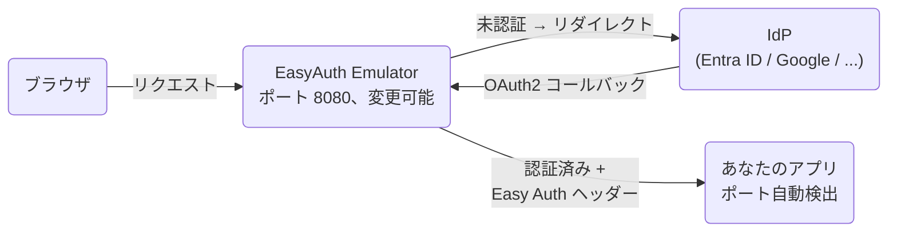

# EasyAuth Emulator

Easy Auth Emulator は Azure App Service / Azure Functions / Azure Container Apps の認証機能を代替する認証ゲートウェイです。ローカル開発および開発環境向けに、Authentication and Authorization（Easy Auth-like）挙動をエミュレートします。複数 IdP 認証、Easy Auth 互換ヘッダー、および関連エンドポイントを提供します。

## なぜ必要か

Azure App Service、Azure Functions、Azure Container Apps の組み込み認証機能（通称 Easy Auth）は強力ですが、利用できるのは Azure 上のみです。これは Easy Auth ヘッダーやエンドポイントに依存するアプリのローカル開発・検証を難しくします。

Easy Auth Emulator はそのギャップを埋めるため、ローカルおよび開発環境で利用できる Azure 認証代替ゲートウェイを提供します。

## 主な機能

- 複数 IdP 認証（Microsoft Entra ID、Google、GitHub、Apple、Facebook、OIDC）
- Easy Auth 互換のリクエストヘッダー
- ローカルおよび開発環境での利用を想定
- Azure App Service、Azure Functions、Azure Container Apps、Azure Static Web Apps（部分対応）の互換性を重視した設計

## 利用モード

| 方法 | 用途 |
| --- | --- |
| **スタンドアロン**（[GitHub Releases](../../releases) からバイナリを取得） | CI / Docker / VS Code 以外の環境 |
| **VS Code 拡張機能** | VS Code でのローカル開発（デバッグセッションに連動して自動起動・停止） |

→ [スタンドアロン セットアップ](#セットアップ) / [VS Code 拡張機能](https://marketplace.visualstudio.com/items?itemName=pnop.easyauth-emulator)

## 代表的な利用イメージ



本番 Azure App Service、Azure Functions、Azure Container Apps、Azure Static Web Apps（部分対応）に互換性のある認証モデルで、ローカル開発を進められます。

## 実装済みエンドポイント

- `GET /.auth/me`
- `GET /.auth/login`
- `GET /.auth/login/<idp>`
  - 例\) `GET /.auth/login/aad`
- `GET /.auth/logout`
- `GET /.auth/refresh` _（互換性のためのダミー実装 — 認証済みは 200 OK、未認証は 401 を返す。トークン更新は行わない）_
- `GET /.auth/login/select` _（エミュレーター独自実装 — Azure Easy Auth には存在しない）_

上記以外の `/.auth/*` エンドポイントは 404 を返します。

## 注入されるヘッダー

認証後にアプリケーションへ転送されるヘッダー:

- `X-MS-CLIENT-PRINCIPAL`
- `X-MS-CLIENT-PRINCIPAL-ID`
- `X-MS-CLIENT-PRINCIPAL-IDP`
- `X-MS-CLIENT-PRINCIPAL-NAME`
- `X-MS-TOKEN-AAD-ACCESS-TOKEN`
- `X-MS-TOKEN-AAD-ID-TOKEN`
- `X-Forwarded-User`
- `X-Forwarded-Email`

未対応: `X-MS-TOKEN-AAD-EXPIRES-ON`、`X-MS-TOKEN-AAD-REFRESH-TOKEN`。

## ディレクトリ構成

```text
start.py               # 起動スクリプト（ソース実行時のみ）
config.toml.example    # 設定テンプレート
config.toml            # 設定ファイル（config.toml.example からコピー）
src/
  app.py               # HTTP ゲートウェイ兼認証アプリ
  sample_app.py        # 動作確認用アプリ
bin/
  oauth2-proxy/
    oauth2-proxy[.exe] # oauth2-proxy バイナリ（初回起動時に自動ダウンロード）
scripts/
  package.py           # 非対応プラットフォーム向けビルドスクリプト
vscode-extension/      # VS Code 拡張機能（TypeScript）
docs/
  configuration-reference.md     # 設定リファレンス（英語）
  configuration-reference_ja.md  # 設定リファレンス（日本語）
```

## セットアップ

### 1. ダウンロード

[GitHub Releases](../../releases) からお使いのプラットフォーム向けのアーカイブをダウンロードして展開してください:

| プラットフォーム | ファイル |
| --- | --- |
| Windows x64 | `easyauth-emulator-<version>-windows-amd64.zip` |
| macOS（Apple Silicon） | `easyauth-emulator-<version>-darwin-arm64.tar.gz` |
| Linux x64 | `easyauth-emulator-<version>-linux-amd64.tar.gz` |
| Linux arm64 | `easyauth-emulator-<version>-linux-arm64.tar.gz` |

> **Windows arm64** — 非対応です。oauth2-proxy が Windows ARM 向けバイナリを配布していないため、サポートできません。

### 2. config.toml を設定する

`config.toml.example` を `config.toml` にコピーして値を入力します。

最小構成（Entra ID の場合）:

```env
# ホストマシン上で動作している開発中のアプリの URL
APP_UPSTREAM=http://localhost:8081

# IDP 設定（Entra ID）
IDP_LIST=entra
IDP_ENTRA_OIDC_ISSUER_URL=https://login.microsoftonline.com/<テナントID>/v2.0
IDP_ENTRA_CLIENT_ID=<クライアントID>
IDP_ENTRA_CLIENT_SECRET=<クライアントシークレット>
```

セキュリティ注意: `config.toml` を外部に公開・共有しないよう注意してください。

設定項目の全一覧は [docs/configuration-reference_ja.md](docs/configuration-reference_ja.md) を参照してください。

### 3. コールバック URL を登録する

IdP のアプリ登録に OAuth2 コールバック URL を登録します:

```text
http://localhost:8080/oauth2/callback
```

ポート番号は `SITE_PORT` に合わせてください。別の origin（転送トンネルドメインなど）経由でもアクセスする場合は、その origin の `/oauth2/callback` も登録してください（使用する origin ごとに 1 件）。

## 利用方法

### 1. 起動する

```powershell
# Windows
.\easyauth-emulator.exe

# config.toml を編集せずに転送先を変更する場合
.\easyauth-emulator.exe --app-upstream http://localhost:3000
```

```sh
# macOS / Linux
./easyauth-emulator

# config.toml を編集せずに転送先を変更する場合
./easyauth-emulator --app-upstream http://localhost:3000
```

**Ctrl+C** で全プロセスが停止します。

コマンドライン オプションの全一覧は [docs/configuration-reference_ja.md](docs/configuration-reference_ja.md) を参照してください。

### 2. ブラウザでアクセスする

ブラウザで `SITE_URL:SITE_PORT`（例: `http://localhost:8080/`）にアクセスします。未認証の場合は IdP のログイン画面へリダイレクトされます。認証後、Easy Auth 互換ヘッダーが付与された状態で `APP_UPSTREAM` のアプリへ転送されます。

### oauth2-proxy のログを確認する

oauth2-proxy の出力はデフォルトで抑制されています。確認したい場合は `config.toml` に以下を追加してください:

```toml
OAUTH2_PROXY_STANDARD_LOGGING = true   # 起動・終了メッセージ
OAUTH2_PROXY_AUTH_LOGGING = true       # 認証イベント
OAUTH2_PROXY_REQUEST_LOGGING = true    # リクエストごとの HTTP ログ
```

## VS Code 拡張機能

デバッグセッションの開始・終了に連動してエミュレーターを自動起動・停止する VS Code 拡張機能が `vscode-extension/` に含まれています。インストールと設定については [VS Code Marketplace ページ](https://marketplace.visualstudio.com/items?itemName=pnop.easyauth-emulator) を参照してください。

## リファレンス

- [docs/configuration-reference_ja.md](docs/configuration-reference_ja.md) — 環境変数リファレンスとトラブルシューティング
- [README.md](README.md) — English version

## 互換性

- Azure Easy Auth の完全一致実装ではありません。
- ローカル開発および互換テスト用途を目的としています。
- ヘッダー対応は部分実装（`X-MS-TOKEN-AAD-EXPIRES-ON`、`X-MS-TOKEN-AAD-REFRESH-TOKEN` は未実装）。
- エンドポイント対応は部分実装（上記の `/.auth/*` エンドポイントのみ実装）。`/.auth/refresh` はダミー実装であり、トークン更新は行いません（認証済み: 200、未認証: 401）。
- `/.auth/logout` は本エミュレーターおよび oauth2-proxy のセッションを必ず先に終了します。IdP 側ブラウザー SSO の終了はベストエフォートです。
- ログインフローにはエミュレーター固有仕様（`/.auth/login/select`、`DEFAULT_IDP`、`IDP_LIST` 1件時の既定化）が含まれます。
- セッション制御は oauth2-proxy の cookie と本エミュレーターのルーティング規則に基づくため、マネージド Easy Auth の内部挙動とは差分が出る場合があります。
- WebSocket には対応していません（HTTP/1.1 のリクエスト/レスポンス型プロキシのみ）。
- gRPCは対応していますが既定オフ・オプトイン方式です — 下記[HTTP/2とgRPC](#http2とgrpc)を参照してください。Azure App Serviceの`http20ProxyFlag`が既定で無効なのと同じ位置づけです。
- Server-Sent Events (SSE) など、レスポンスをストリーミングするエンドポイントには対応していません。プロキシが upstream からの応答を全て読み切ってから返すため、応答が完了しないエンドポイントはハングします。
- `Transfer-Encoding: chunked`（`Content-Length` なし）で送られたリクエストボディは、アプリケーションへ転送されません。

## HTTP/2とgRPC

既定では、このゲートウェイは`SITE_PORT`上でHTTP/1.1のみを話します。以下の2つの設定でHTTP/2対応が追加されます。既存のHTTP/1.1と**併用**であり、排他ではありません——Azure App Serviceの「HTTPバージョン: 2.0」設定と同じ考え方です。

```toml
HTTP20_ENABLED = true            # SITE_PORT上でHTTP/1.1と併せてHTTP/2も受け付ける
HTTP20_PROXY_MODE = "grpc-only"  # "disabled" | "all" | "grpc-only"
```

`HTTP20_PROXY_MODE`は、HTTP/2リクエストをどこまで`APP_UPSTREAM`まで維持するかを制御します。Azure App Serviceの`http20ProxyFlag`に相当します。

- **`disabled`**（既定）— `APP_UPSTREAM`への全リクエストをHTTP/1.1で送信します（クライアントがHTTP/2を使っていても同様）。通常のリクエスト/レスポンス型通信には問題ありませんが、gRPCは壊れます——ストリーミングやtrailerでのステータス通知（`grpc-status`）はHTTP/1.1では表現できません。
- **`all`** — 全リクエストをHTTP/2のまま`APP_UPSTREAM`に中継します。`APP_UPSTREAM`がそのポートで実際にHTTP/2を話せる必要があります（平文h2c、またはTLS+ALPN——nginxのようにHTTP/2をTLS上でしか話さない相手でも、`APP_UPSTREAM`を`https://`にすれば動作します）。
- **`grpc-only`** — `Content-Type`が`application/grpc`で始まるリクエストだけHTTP/2のまま中継し、他は`disabled`と同様にHTTP/1.1に変換します。`APP_UPSTREAM`が同じポートでgRPCサービスと通常のHTTPエンドポイントの両方を提供している場合に使用します。

補足:

- クライアント側のHTTP/2受け入れは、平文（h2c）と、`TLS_CERT_FILE`/`TLS_KEY_FILE`設定時のTLS+ALPNネゴシエーションの両方に対応しています——実際のブラウザ（TLS経由でのみHTTP/2を交渉）と同じ挙動です。
- `APP_UPSTREAM`は`https://`でも指定できます。`HTTP20_PROXY_MODE = "disabled"`（TLS上でHTTP/1.1として中継）と`"all"`/`"grpc-only"`（TLS+ALPNでHTTP/2として中継。`h2`がネゴシエートされない場合は失敗）の両方で対応します。証明書検証は`SSL_CA_BUNDLE`が設定されていればそれを、なければOSの証明書ストアを使用します——mkcert等で発行したローカル開発用証明書も、そのCAをOSストアにインストール済みであれば追加設定なしで検証できます。
- App Service（別ポート`HTTP20_ONLY_PORT`が必要）とは異なり、こちらのgRPCは`SITE_PORT`を他の全てと共有します——Azure Container Appsの単一ingress方式に近い設計です。
- `APP_UPSTREAM`へのHTTP/2中継は単項リクエスト/レスポンスのみです（既存のHTTP/1.1版`_proxy_to`も双方向を全部バッファリングする実装なので、それと同じ制約です）——汎用的な双方向ストリーミング対応のgRPCクライアントではありません。

## 非対応プロバイダー

### Twitter / X

Azure App Service / Container Apps の Easy Auth は Twitter/X 認証に対応していますが、本エミュレーターではエミュレーションできません。
Twitter/X は OpenID Connect を持たない OAuth 2.0 を使用しており、oauth2-proxy v7 以降でネイティブの Twitter プロバイダーが削除されました。
現時点では oauth2-proxy を通じた回避策はありません。
