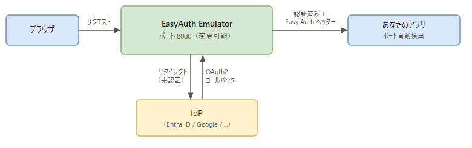

# EasyAuth Emulator

Azure App Service / Azure Functions / Azure Container Apps 認証をローカル開発環境でエミュレートします。

EasyAuth Emulator は Azure App Service / Azure Functions / Azure Container Apps の認証機能をローカルで代替するゲートウェイです。この拡張機能は VS Code のデバッグワークフローに統合されており、デバッグ開始と同時にエミュレーターが起動し、デバッグ停止と同時に終了します。

---

## なぜ必要か

Azure App Service、Azure Functions、Azure Container Apps の組み込み認証機能（通称 Easy Auth）は強力ですが、利用できるのは Azure 上のみです。そのため、Easy Auth ヘッダーやエンドポイントに依存するアプリのローカル開発・検証が難しくなります。

EasyAuth Emulator はこの問題を解決するため、開発マシン上で互換性のある認証ゲートウェイを実行し、Easy Auth が有効な環境と同じように開発・テストできるようにします。

---

## 動作の仕組み



拡張機能はアプリのリッスンポートを `launch.json`・フレームワーク設定ファイル（`.env`、`launchSettings.json`、`application.properties` など）・デバッグ出力から自動検出します。多くのプロジェクトでは手動設定なしで動作します。

---

## 機能

- **複数 IdP 認証** — Microsoft Entra ID・Google・GitHub・Apple・Facebook および OIDC 対応プロバイダー
- **Easy Auth 互換ヘッダー** — 認証済みリクエストに `X-MS-CLIENT-PRINCIPAL`・`X-MS-CLIENT-PRINCIPAL-ID` などのヘッダーを注入
- **Azure サービス互換性** — Azure App Service・Azure Functions・Azure Container Apps・Azure Static Web Apps（部分対応）
- **自動起動 / 自動停止** — デバッグセッションのライフサイクルに連動
- **スマートなポート検出** — `launch.json`・フレームワーク設定・デバッグ標準出力を順に参照し、最終手段としてのみ確認ダイアログを表示
- **安全なシークレット管理** — クライアントシークレットは VS Code の SecretStorage によりクライアント側（デスクトップ版では OS キーチェーン）に保存され、設定ファイルには書き込まれない
- **カスタム OIDC プロバイダー** — OIDC 対応プロバイダーを `easyauth.customIdps` で追加可能
- **ステータスバー表示** — 状態に応じたアクション（起動・停止・ログ表示など）にワンクリックでアクセス
- **エクスプローラービュー** — アクティビティバーのエクスプローラーパネルにエミュレーターの状態と操作ボタンを表示
- **プライベートブラウザー起動** — `easyauth.privateBrowser.command` を設定すると、プライベート/シークレットウィンドウでゲートウェイ URL を開くボタンが表示される（リモートセッションでは URL をクリップボードにコピーするボタンに切り替わる）

---

## 動作要件

| 要件 | 詳細 |
| --- | --- |
| VS Code | 1.93 以降 |
| プラットフォーム | Windows x64、macOS（Apple Silicon）、Linux x64、Linux arm64 |

> 対象プラットフォームの `.vsix` がまだ公開されていない場合は、リポジトリのルートで `python scripts/package.py --vsix` を実行してバイナリと `.vsix` をビルドし、**Extensions: Install from VSIX** でインストールしてください。
>
> **Windows arm64** — 非対応です。oauth2-proxy が Windows ARM 向けバイナリを配布していないため、サポートできません。
>
> **Web 版 VS Code（vscode.dev）** — vscode.dev 単体（リモート接続なし）では動作しません。エミュレーターバイナリの実行にはネイティブ OS アクセスが必要です。ブラウザクライアントからリモートに接続している場合（vscode.dev + Remote - Tunnels など）は、拡張機能はリモートホスト側で動作するため通常どおり使用できます。
>
> **制限モード／仮想ワークスペース** — 非対応です。制限モード（信頼していないワークスペース）および仮想ワークスペース（GitHub Repositories 拡張機能など）では拡張機能が非活性化されます。使用するにはワークスペースを信頼してください。

追加のランタイムインストールは不要です。エミュレーターのバイナリは拡張機能に同梱されています。

---

## セットアップ手順

### 1. IdP を設定する

ワークスペース設定（`Ctrl`+`,` → `easyauth` で検索）を開き、使用する IdP のクライアント ID とイシュアー URL を入力します。各 IdP に必要な設定項目は[対応 IdP](#対応-idp) を参照してください。

### 2. クライアントシークレットを保存する

コマンドパレット（`Ctrl`+`Shift`+`P`）から **EasyAuth Emulator: Set Client Secret** を実行し、手順1で設定した IdP のクライアントシークレットを入力します。シークレットは VS Code の SecretStorage API 経由で**クライアント側**に保存されます — デスクトップ版 VS Code では OS キーチェーン（Windows では資格情報マネージャー）、Web クライアント（vscode.dev）ではブラウザのストレージ。設定ファイルやリモートホストには保存されません。ストアはクライアントごとに独立しているため、クライアントを切り替えると（デスクトップ版 ⇔ vscode.dev など）シークレットの再入力が必要です。

### 3. コールバック URL を登録する

IdP のアプリ登録画面で、以下のリダイレクト URI を追加します:

```text
http://localhost:8080/oauth2/callback
```

`easyauth.site.port` を変更した場合はそのポート番号を使用してください。別の origin（転送トンネルドメインなど）経由でもアクセスする場合は、その origin の `/oauth2/callback` も登録してください（使用する origin ごとに 1 件）。

> **GitHub・Facebook** を使用する場合は追加の設定が必要です。設定リファレンスの [GitHub プロバイダーに関する注意](https://github.com/pnopjp/easyauth-emulator/blob/main/docs/configuration-reference_ja.md#github-プロバイダーに関する注意) および [Facebook プロバイダーに関する注意](https://github.com/pnopjp/easyauth-emulator/blob/main/docs/configuration-reference_ja.md#facebook-プロバイダーに関する注意) を参照してください。

---

## 利用方法

**F5** を押してデバッグを開始すると、アプリ起動後にエミュレーターが自動起動します。

起動後はステータスバーの `EasyAuth: <port>:<upstream>` をクリックするとブラウザでゲートウェイが開きます。URL を直接入力する場合は `http://localhost:8080/`（または `easyauth.site.port` で設定したポート）を使用してください。

---

## ステータスバー

画面左下のステータスバー項目でエミュレーターの状態を確認できます。クリックすると状態に応じたアクションが実行されます:

| 表示 | 意味 | クリック時の動作 |
| --- | --- | --- |
| `$(warning) EasyAuth: no config` | 未設定（IdP が構成されていない） | Settings を開く |
| `$(lock) EasyAuth: secret missing`（黄色背景） | Client ID 設定済み・クライアントシークレット未登録 | クライアントシークレットの入力ポップアップを表示 |
| `$(warning) EasyAuth: Entra issuer missing`（黄色背景） | Entra の Client ID・シークレット設定済み・OIDC Issuer URL 未設定 | Settings の `easyauth.entra.oidcIssuerUrl` を開く |
| `$(sync~spin) EasyAuth: starting...` | 起動中 | 出力チャンネルを開く |
| `$(shield) EasyAuth: 8080:3000` | 実行中 — ゲートウェイポートとアプリのポート | ブラウザで開く |
| `$(shield) EasyAuth: stopped` | 停止中 | エミュレーターを起動 |
| `$(error) EasyAuth: error`（赤背景） | 起動失敗 | 1回目: 出力チャンネルを開く / 2回目: エミュレーターを起動 |

---

## エクスプローラービュー

アクティビティバーの **エクスプローラー** パネルに **EasyAuth Emulator** ビューが表示されます。ステータスバーと同じ状態を確認でき、ビュータイトルバーのアイコンから以下の操作が行えます:

| 状態 | 表示されるボタン |
| --- | --- |
| 未設定 | 設定を開く |
| クライアントシークレット未設定 | シークレットを設定する |
| 停止中 / エラー | 起動 |
| 起動中 / 実行中 | 再起動、停止 |
| 起動中 / 実行中 / エラー | 出力チャンネルを開く |
| 実行中 | ブラウザで開く、プライベートブラウザーで開く（設定済みの場合。リモートセッションでは「Copy URL for Private Browser」） |

---

## コマンド

すべてのコマンドはコマンドパレット（`Ctrl`+`Shift`+`P`）から実行できます:

| コマンド | 説明 |
| --- | --- |
| `EasyAuth Emulator: Start` | エミュレーターを手動起動する |
| `EasyAuth Emulator: Stop` | エミュレーターを停止する |
| `EasyAuth Emulator: Restart` | エミュレーターを再起動する（設定変更後に使用） |
| `EasyAuth Emulator: Open Output` | ログ出力チャンネルを開く |
| `EasyAuth Emulator: Open in Browser` | ゲートウェイ URL をブラウザで開く |
| `EasyAuth Emulator: Open in Private Browser` | プライベート/シークレットウィンドウでゲートウェイ URL を開く（`easyauth.privateBrowser.command` 設定時のみ表示）。リモートセッションではローカル PC でブラウザを起動できないため、URL をクリップボードにコピーする |
| `EasyAuth Emulator: Copy URL for Private Browser` | ゲートウェイ URL をクリップボードにコピーする（リモートセッションで「Open in Private Browser」の代わりに表示） |
| `EasyAuth Emulator: Open Settings` | EasyAuth の拡張機能設定を開く |
| `EasyAuth Emulator: Set Client Secret` | クライアントシークレットを VS Code の SecretStorage（クライアント側）に保存する |
| `EasyAuth Emulator: Clear Client Secret` | 保存されたクライアントシークレットを削除する |

---

## 対応 IdP

### 組み込み

| プロバイダー | 必須設定 |
| --- | --- |
| **Microsoft Entra ID** | `easyauth.entra.clientId`、`easyauth.entra.oidcIssuerUrl` |
| **Google** | `easyauth.google.clientId` |
| **GitHub** | `easyauth.github.clientId` |
| **Apple** | `easyauth.apple.clientId` |
| **Facebook** | `easyauth.facebook.clientId` |

`clientId` が設定されているすべての IdP が自動的に有効になります。少なくとも 1 つの `clientId` を設定する必要があります。

> **`easyauth.entra.oidcIssuerUrl` に指定する値**
>
> テナント固有のエンドポイントを使う場合（推奨）:
>
> ```text
> https://login.microsoftonline.com/<テナントID>/v2.0
> ```
>
> テナント ID は Azure ポータルの「Microsoft Entra ID」→「概要」で確認できます。

### カスタム OIDC プロバイダー

`easyauth.customIdps` を使用して、任意の OIDC 対応プロバイダーを追加できます:

```jsonc
// .vscode/settings.json
{
  "easyauth.customIdps": [
    {
      "name": "my-provider",
      "displayName": "My Provider",
      "clientId": "your-client-id",
      "oidcIssuerUrl": "https://your-provider.example.com"
    }
  ]
}
```

カスタムプロバイダーを追加した後、**EasyAuth Emulator: Set Client Secret** でクライアントシークレットを保存してください。

設定できるフィールドの一覧:

| フィールド | 必須 | 説明 |
| --- | :---: | --- |
| `name` | ✓ | `IDP_LIST` に使用する IdP 識別子（小文字英数字とハイフン） |
| `clientId` | ✓ | OAuth2 / OIDC クライアント ID |
| `oidcIssuerUrl` | ✓ | OIDC issuer URL（例: `https://your-provider.example.com`） |
| `displayName` | | IdP 選択画面に表示する名前 |
| `scopes` | | OAuth2 スコープ（スペース区切り）。既定: `openid profile email` |
| `authUserIdClaim` | | ユーザー ID として使用する JWT claim。既定: `sub` |
| `authProvider` | | `X-MS-CLIENT-PRINCIPAL-IDP` ヘッダーに設定する値 |
| `prompt` | | OIDC `prompt` パラメーター（`login`、`consent` など） |
| `codeChallengeMethod` | | PKCE コードチャレンジ方式: `S256` または `plain` |
| `logoutEndpoint` | | IdP ログアウト URL の上書き |
| `skipClaimsFromProfileUrl` | | `true` にすると userinfo エンドポイントからの claim 取得をスキップ |
| `extraArgs` | | oauth2-proxy に追加で渡す起動オプション（スペース区切り、例: `"--allowed-group=my-group --oidc-extra-audience=myapp"`） |
| `icon` | | IdP 選択画面に表示するアイコン。[Simple Icons](https://simpleicons.org) のスラッグ（例: `"auth0"`）または画像 URL を指定。`IDP_SELECT_ICONS` が `generic` または `text` の場合は無効。 |

---

## 設定リファレンス

すべてのパラメーターの詳細については [docs/configuration-reference_ja.md](https://github.com/pnopjp/easyauth-emulator/blob/main/docs/configuration-reference_ja.md) を参照してください。

### `.vscode/easyauth.toml`（オプション）

拡張機能は起動時に常に `--config .vscode/easyauth.toml` をエミュレーターに渡します。

- **ファイルが存在する場合:** ベース設定として読み込まれます。VS Code 設定 UI で公開されていない高度なオプション（`config.toml` 形式で指定するパラメーター）を使いたい場合に活用できます。VS Code 設定（`settings.json`）の値は環境変数経由でさらに上書きします。
- **ファイルが存在しない場合:** プロジェクトルートの `config.toml` を自動探索しないよう抑制されます（スタンドアローン用 `config.toml` を意図せず読み込まないための動作）。

### 拡張機能の動作

| 設定 | デフォルト | 説明 |
| --- | --- | --- |
| `easyauth.autoStart` | `true` | デバッグセッション開始時にエミュレーターを自動起動 |
| `easyauth.autoStop` | `true` | デバッグセッション終了時にエミュレーターを自動停止 |
| `easyauth.upstreamPort` | `null` | アプリのポートを固定指定。`null` で自動検出 |
| `easyauth.portScanMax` | `5` | 自動検出時にスキャンする連続ポート数 |
| `easyauth.portScanBase` | `null` | スキャン開始ポート。`null` で検出されたヒントを使用 |
| `easyauth.verbose` | `false` | 起動時に解決された設定値をすべてログ出力（シークレットはマスク） |
| `easyauth.privateBrowser.command` | `""` | プライベート/シークレットウィンドウを起動するコマンド。サイト URL が末尾引数として付加される（例: `msedge --inprivate`、`chrome --incognito`、`firefox --private-window`）。空欄の場合はボタン非表示。リモートセッションでは使用されない（ボタンが URL のクリップボードコピーに切り替わるため） |

### ゲートウェイ

| 設定 | デフォルト | 説明 |
| --- | --- | --- |
| `easyauth.site.url` | `http://localhost` | 通常は変更不要。TLS 終端するフロント（リバースプロキシ）が `X-Forwarded-Proto` を送らない場合のみ `https://` の値を設定 |
| `easyauth.site.port` | `8080` | ゲートウェイのリッスンポート（直接アクセス時は公開ポートを兼ねる） |
| `easyauth.tls.certFile` | `""` | TLS 証明書ファイルのパス（PEM 形式）。`tls.keyFile` と合わせて設定すると HTTPS が有効になります。Facebook Login では必須。 |
| `easyauth.tls.keyFile` | `""` | TLS 秘密鍵ファイルのパス（PEM 形式）。`tls.certFile` と合わせて設定すると HTTPS が有効になります。Facebook Login では必須。 |
| `easyauth.http20Enabled` | `false` | `site.port`上でHTTP/1.1に加えてHTTP/2も受け付ける |
| `easyauth.http20ProxyMode` | `disabled` | HTTP/2リクエストをどこまでそのままアップストリームアプリに中継するか: `disabled`、`all`、`grpc-only` |
| `easyauth.appserviceHttp20OnlyPort` | 未設定 | Azure App Serviceの`HTTP20_ONLY_PORT`に相当（Azure Container Appsでは未設定のままでよい）。HTTP/2で中継されるリクエストは、アプリの通常のポートではなくこのポートへ送られる。 |
| `easyauth.webSocketsEnabled` | `true` | WebSocket（HTTP/1.1のUpgradeとHTTP/2のRFC 8441拡張CONNECTの両方）を中継するかどうか。Azure App Serviceの「Web sockets」On/Offスイッチに相当。LinuxのApp Serviceでは常に実質On固定で、Windowsのみ実際にOffにできる。 |
| `easyauth.defaultIdp` | `""` | `/.auth/login` アクセス時にデフォルトで使用する IdP |
| `easyauth.skipAuthRoutes` | `""` | 認証をバイパスするルート — カンマ区切りの `[METHOD=]REGEX` パターン |
| `easyauth.debugHeadersEndpointEnabled` | `false` | `GET /.debug/headers` エンドポイントを有効化（注入されたヘッダーを確認可能） |
| `easyauth.idpSelectIcons` | `simple` | IdP 選択画面のアイコンスタイル: `simple`、`generic`、`text` |

### oauth2-proxy

| 設定 | デフォルト | 説明 |
| --- | --- | --- |
| `easyauth.oauth2proxy.portBase` | `4180` | 内部 oauth2-proxy インスタンスのベースポート |
| `easyauth.oauth2proxy.standardLogging` | `false` | 起動・終了メッセージを出力チャンネルに表示 |
| `easyauth.oauth2proxy.authLogging` | `false` | 認証イベントを出力チャンネルに表示 |
| `easyauth.oauth2proxy.requestLogging` | `false` | リクエストごとの HTTP ログを出力チャンネルに表示 |
| `easyauth.oauth2proxy.showDebugOnError` | `false` | OIDC エラー時に詳細情報を表示（初期セットアップ時に有効） |
| `easyauth.oauth2proxy.version` | `""` | oauth2-proxy のバージョンを固定（例: `v7.6.0`） |
| `easyauth.oauth2proxy.autoUpdate` | `false` | 起動時に oauth2-proxy を最新バージョンへ自動更新 |
| `easyauth.oauth2proxy.sslCaBundle` | `""` | カスタム CA 証明書バンドル（PEM）のパス。通常は不要 — OS の証明書ストアが自動参照されます。 |
| `easyauth.oauth2proxy.trustedProxyIp` | `""` | `X-Forwarded-*` ヘッダーを受け入れる信頼するリバースプロキシの IP アドレスまたは CIDR（カンマ区切り）。`APP_UPSTREAM` がローカルホストを指している場合は `127.0.0.1,::1` が自動設定されます。Docker など非ローカル環境では明示的に指定（例: `172.17.0.0/16`）。 |

---

## 実装済み Easy Auth エンドポイント

| エンドポイント | 説明 |
| --- | --- |
| `GET /.auth/me` | 現在のユーザーのクレームを JSON で返す |
| `GET /.auth/login` | 設定済み IdP のログイン画面へリダイレクト |
| `GET /.auth/login/<idp>` | 指定した IdP でログイン |
| `GET /.auth/login/aad` | `entra` のエイリアス（Azure AD 互換） |
| `GET /.auth/logout` | ログアウトしてセッションをクリア |
| `GET /.auth/refresh` | Azure Easy Auth 互換のためのダミー実装 — 認証済みは 200、未認証は 401 を返す。トークン更新は行わない |
| `GET /.auth/login/select` | IdP 選択画面を表示（複数 IdP 設定時）— エミュレーター独自実装、Azure Easy Auth には存在しない |

---

## Easy Auth 互換ヘッダー

認証後、以下のヘッダーがアプリへのリクエストに注入されます:

- `X-MS-CLIENT-PRINCIPAL`（Base64 エンコードされたクレーム JSON）
- `X-MS-CLIENT-PRINCIPAL-ID`
- `X-MS-CLIENT-PRINCIPAL-IDP`
- `X-MS-CLIENT-PRINCIPAL-NAME`
- `X-MS-TOKEN-AAD-ACCESS-TOKEN`
- `X-MS-TOKEN-AAD-ID-TOKEN`
- `X-Forwarded-User`
- `X-Forwarded-Email`

未実装: `X-MS-TOKEN-AAD-EXPIRES-ON`、`X-MS-TOKEN-AAD-REFRESH-TOKEN`

---

## トラブルシューティング

### ステータスバーに `$(warning) EasyAuth: no config` が表示される

IdP が設定されていません。ワークスペース設定で少なくとも 1 つの `clientId` を入力し、コマンドパレットから **EasyAuth Emulator: Set Client Secret** を実行してください。

### ステータスバーに `$(lock) EasyAuth: secret missing` が表示される

Client ID は登録されていますが、クライアントシークレットが未登録です。ステータスバーをクリックするとシークレット入力ポップアップが表示されます。または、コマンドパレットから **EasyAuth Emulator: Set Client Secret** を実行してください。シークレットを保存すると自動的に `stopped` 状態に切り替わります。

### ステータスバーに `$(warning) EasyAuth: Entra issuer missing` が表示される

Microsoft Entra ID の Client ID とクライアントシークレットは設定済みですが、OIDC Issuer URL が未設定です。ステータスバーをクリックすると、ワークスペース設定の `easyauth.entra.oidcIssuerUrl` フィールドが開きます。Entra ID の Issuer URL（例: `https://login.microsoftonline.com/<テナントID | common | organizations | consumers>/v2.0`）を入力してください。

### ログインが失敗する — リダイレクト URI の不一致（`AADSTS50011` など）

コールバック URL はブラウザのアドレスバーに表示されている origin に追従します。IdP のアプリ登録に、それと一致するリダイレクト URI を追加してください:

```text
<ブラウザがアクセスしている origin>/oauth2/callback
```

例: `http://localhost:8080/oauth2/callback`（`easyauth.site.port` を変更している場合はそのポート番号）。使用する origin ごとに 1 件ずつ登録してください。

### ログインが失敗する — `invalid_client`

`clientId` またはクライアントシークレットが IdP のアプリ登録と一致していません。両方の値を確認し、**EasyAuth Emulator: Set Client Secret** でシークレットを更新してください。

### アプリのポートが自動検出されない

拡張機能がアプリのリッスンポートを特定できませんでした。ワークスペース設定で `easyauth.upstreamPort` を手動指定してください:

```json
{ "easyauth.upstreamPort": 5000 }
```

### デバッグ中にアクセスすると 502 エラーになる

エミュレーターがアップストリームのアプリに接続できていない状態です。考えられる原因:

- アプリがクラッシュした、または起動途中でまだポートにバインドしていない
- `easyauth.upstreamPort` を手動指定している場合、ポートがアプリのリッスンポートと一致していない

アプリのログを確認し、正常に起動・稼働していることを確認してください。

### 初回起動時にタイムアウトになる

初回起動時に `oauth2-proxy` を GitHub Releases からダウンロードするため、30 秒以上かかる場合があります。出力チャンネルに `oauth2-proxy ... installed at ...` が表示されたらダウンロード完了です。**EasyAuth Emulator: Restart** で再起動してください。

### 認証コールバック後に空白ページが表示される

VS Code の組み込みブラウザ（**Simple Browser**）は Cookie サポートが制限されており、OAuth2 フローが完了しません。Chrome・Edge・Firefox などの外部ブラウザを使用してください。

### 2 つ目のデバッグセッションを開始したらエミュレーターが停止した

エミュレーターを制御するのは最初のデバッグセッションのみです。そのセッションを停止するとエミュレーターも停止します。2 つ目のセッションはエミュレーターの起動・停止に影響しません。手動操作が必要な場合はコマンドパレットの **EasyAuth Emulator: Start / Stop / Restart** を使用してください。

### VS Code を強制終了した後もエミュレーターのプロセスが残っている

内部の `oauth2-proxy` プロセスは OS の仕組みにより自動終了します。エミュレーター本体が孤立した場合は手動で終了してください。

- **Windows:** タスクマネージャーで `easyauth-emulator.exe` を終了
- **macOS:** アクティビティモニター、または `pkill easyauth-emulator`
- **Linux:** `pkill easyauth-emulator`

### その他のトラブルシューティング

oauth2-proxy エラー・OIDC 設定の問題・ランタイム診断など、さらに詳しいトラブルシューティング情報は[ランタイムガイド: トラブルシューティング](https://github.com/pnopjp/easyauth-emulator/blob/main/docs/configuration-reference_ja.md#%E3%83%88%E3%83%A9%E3%83%96%E3%83%AB%E3%82%B7%E3%83%A5%E3%83%BC%E3%83%86%E3%82%A3%E3%83%B3%E3%82%B0)を参照してください。

---

## リモート開発

いずれの場合も、拡張機能とエミュレーターはリモートホスト側で動作します。

### Remote - SSH

既定の設定のまま動作します。ゲートウェイへはローカル実行時と同じ方法でアクセスできます。

### Remote - Tunnels

ゲートウェイは `localhost` ではなく、トンネルの転送 URL（例: `https://xxxxxxxx-8080.usw2.devtunnels.ms`）で公開されます。サインインするには:

1. 転送 URL を確認する — 一度デバッグ実行（またはエミュレーターを起動）すると、EasyAuth Emulator の Output と、**Open in Browser** クリック時の通知に表示されます。
2. IdP のアプリ登録のリダイレクト URI に `<転送 URL>/oauth2/callback` を追加する。

> **vscode.dev（ブラウザクライアント）+ Tunnels** — **Open in Browser** と **Copy URL for Private Browser** には対応しておらず、代わりに案内メッセージを表示します。ゲートウェイへは **PORTS** パネルにあるゲートウェイポートの「転送されたアドレス」からアクセスしてください。

転送 URL はトンネルが存在する間は変わりませんが、トンネルを作り直すと変わります — 例: `code tunnel unregister` を実行した後や、未使用のトンネルが期限切れになった場合（既定では 30 日間アクティビティがないと削除）。その際は IdP のリダイレクト URI を更新してください。トンネルの有効期間の詳細は [dev tunnels FAQ の「使用されていない開発トンネルはいつ削除されますか?」](https://learn.microsoft.com/ja-jp/azure/developer/dev-tunnels/faq) を参照してください。

dev tunnels で転送できるポートは 1 トンネルあたり最大 10 個です。一方、VS Code は検出した待ち受けポートを自動的にトンネルへ転送するため、転送の不要なエミュレーター内部の oauth2-proxy ポート（4180、4181、…）まで登録され、上限をすぐに使い切ってしまいます。次の設定で内部ポートを自動転送の対象外にすることを推奨します:

```jsonc
// .vscode/settings.json
"remote.portsAttributes": {
  "4180-4189": { "onAutoForward": "ignore" }
}
```

### Dev Containers

既定の設定のまま動作します。ゲートウェイへはローカル実行時と同じ方法でアクセスできます。

### WSL

既定の設定のまま動作します。ゲートウェイへはローカル実行時と同じ方法でアクセスできます。

---

## 既知の制限事項

- `X-MS-TOKEN-AAD-EXPIRES-ON` および `X-MS-TOKEN-AAD-REFRESH-TOKEN` ヘッダーは未実装
- 本ツールは開発用途向けであり、Azure Easy Auth の完全な複製ではありません

---

## ライセンス

[Apache License 2.0](https://github.com/pnopjp/easyauth-emulator/blob/main/LICENSE)
