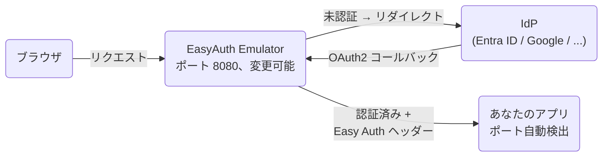

# EasyAuth Emulator

Azure App Service / Azure Functions / Azure Container Apps 認証をローカル開発環境でエミュレートします。

EasyAuth Emulator は Azure App Service / Azure Functions / Azure Container Apps の認証機能をローカルで代替するゲートウェイです。この拡張機能は VS Code のデバッグワークフローに統合されており、デバッグ開始と同時にエミュレーターが起動し、デバッグ停止と同時に終了します。

---

## なぜ必要か

Azure App Service、Azure Functions、Azure Container Apps の組み込み認証機能（通称 Easy Auth）は強力ですが、利用できるのは Azure 上のみです。そのため、Easy Auth ヘッダーやエンドポイントに依存するアプリのローカル開発・検証が難しくなります。

EasyAuth Emulator はこの問題を解決するため、開発マシン上で互換性のある認証ゲートウェイを実行し、Easy Auth が有効な環境と同じように開発・テストできるようにします。

---

## 動作の仕組み



拡張機能はアプリのリッスンポートを `launch.json`・フレームワーク設定ファイル（`.env`、`launchSettings.json`、`application.properties` など）・デバッグ出力から自動検出します。多くのプロジェクトでは手動設定なしで動作します。

---

## 機能

- **複数 IdP 認証** — Microsoft Entra ID・Google・GitHub・Apple・Facebook および OIDC 対応プロバイダー
- **Easy Auth 互換ヘッダー** — 認証済みリクエストに `X-MS-CLIENT-PRINCIPAL`・`X-MS-CLIENT-PRINCIPAL-ID` などのヘッダーを注入
- **Azure サービス互換性** — Azure App Service・Azure Functions・Azure Container Apps・Azure Static Web Apps（部分対応）
- **自動起動 / 自動停止** — デバッグセッションのライフサイクルに連動
- **スマートなポート検出** — `launch.json`・フレームワーク設定・デバッグ標準出力を順に参照し、最終手段としてのみ確認ダイアログを表示
- **安全なシークレット管理** — クライアントシークレットは OS キーチェーンに保存され、設定ファイルには書き込まれない
- **カスタム OIDC プロバイダー** — OIDC 対応プロバイダーを `easyauth.customIdps` で追加可能
- **ステータスバー表示** — 状態に応じたアクション（起動・停止・ログ表示など）にワンクリックでアクセス

---

## 動作要件

| 要件 | 詳細 |
|---|---|
| VS Code | 1.88 以降 |
| プラットフォーム | Windows x64、macOS arm64、Linux x64 |

> **macOS x64（Intel）および Linux arm64** — これらのプラットフォーム向けのビルド済みバイナリは同梱されていません。リポジトリのルートで `python scripts/package.py --vsix` を実行するとバイナリと `.vsix` の両方がビルドされます。生成された `.vsix` を **Extensions: Install from VSIX** でインストールしてください。

追加のランタイムインストールは不要です。エミュレーターのバイナリは拡張機能に同梱されています。

---

## セットアップ手順

### 1. IdP を設定する

ワークスペース設定（`Ctrl+,` → `easyauth` で検索）を開き、使用する IdP のクライアント ID とイシュアー URL を入力します。各 IdP に必要な設定項目は[対応 IdP](#対応-idp) を参照してください。

### 2. クライアントシークレットを保存する

コマンドパレット（`Ctrl+Shift+P`）から **EasyAuth Emulator: Set Client Secret** を実行し、手順1で設定した IdP のクライアントシークレットを入力します。シークレットは VS Code の SecretStorage API（内部では OS キーチェーン — Windows では資格情報マネージャー）に保存され、設定ファイルには書き込まれません。

### 3. コールバック URL を登録する

IdP のアプリ登録画面で、以下のリダイレクト URI を追加します:

```text
http://localhost:8080/oauth2/callback
```

`easyauth.site.port` を変更した場合はそのポート番号を使用してください。

---

## 利用方法

**F5** を押してデバッグを開始すると、アプリ起動後にエミュレーターが自動起動します。

起動後はブラウザで `http://localhost:8080/` に直接アクセスしてください。`easyauth.site.port` を変更した場合はそのポート番号を使用してください。コマンドパレットから **EasyAuth Emulator: Open in Browser** を実行してブラウザで直接開くこともできます。

---

## ステータスバー

画面左下のステータスバー項目でエミュレーターの状態を確認できます。クリックすると状態に応じたアクションが実行されます:

| 表示 | 意味 | クリック時の動作 |
| --- | --- | --- |
| `$(warning) EasyAuth: no config` | 未設定（IdP が構成されていない） | Settings を開く |
| `$(sync~spin) EasyAuth: starting...` | 起動中 | 出力チャンネルを開く |
| `$(shield) EasyAuth: 8080:3000` | 実行中 — ゲートウェイポートとアプリのポート | ブラウザで開く |
| `$(shield) EasyAuth: stopped` | 停止中 | エミュレーターを起動 |
| `$(error) EasyAuth: error`（赤背景） | 起動失敗 | 1回目: 出力チャンネルを開く / 2回目: エミュレーターを起動 |

---

## コマンド

すべてのコマンドはコマンドパレット（`Ctrl+Shift+P`）から実行できます:

| コマンド | 説明 |
|---|---|
| `EasyAuth Emulator: Start` | エミュレーターを手動起動する |
| `EasyAuth Emulator: Stop` | エミュレーターを停止する |
| `EasyAuth Emulator: Restart` | エミュレーターを再起動する（設定変更後に使用） |
| `EasyAuth Emulator: Open Output` | ログ出力チャンネルを開く |
| `EasyAuth Emulator: Open in Browser` | ゲートウェイ URL をブラウザで開く |
| `EasyAuth Emulator: Set Client Secret` | クライアントシークレットを OS キーチェーンに保存する |
| `EasyAuth Emulator: Clear Client Secret` | 保存されたクライアントシークレットを削除する |

---

## 対応 IdP

### 組み込み

| プロバイダー | 必須設定 |
|---|---|
| **Microsoft Entra ID** | `easyauth.entra.clientId`、`easyauth.entra.oidcIssuerUrl` |
| **Google** | `easyauth.google.clientId` |
| **GitHub** | `easyauth.github.clientId` |
| **Apple** | `easyauth.apple.clientId` |
| **Facebook** | `easyauth.facebook.clientId` |

`clientId` が設定されているすべての IdP が自動的に有効になります。少なくとも 1 つの `clientId` を設定する必要があります。

> **`easyauth.entra.oidcIssuerUrl` に指定する値**
>
> テナント固有のエンドポイントを使う場合（推奨）:
>
> ```text
> https://login.microsoftonline.com/<テナントID>/v2.0
> ```
>
> テナント ID は Azure ポータルの「Microsoft Entra ID」→「概要」で確認できます。
>
> 空欄にするとマルチテナント用共通エンドポイント（`https://login.microsoftonline.com/common/v2.0`）が使われ、任意のテナントのアカウントでログイン可能になります。

### カスタム OIDC プロバイダー

`easyauth.customIdps` を使用して、任意の OIDC 対応プロバイダーを追加できます:

```jsonc
// .vscode/settings.json
{
  "easyauth.customIdps": [
    {
      "name": "my-provider",
      "displayName": "My Provider",
      "clientId": "your-client-id",
      "oidcIssuerUrl": "https://your-provider.example.com"
    }
  ]
}
```

カスタムプロバイダーを追加した後、**EasyAuth Emulator: Set Client Secret** でクライアントシークレットを保存してください。

---

## 設定リファレンス

### 拡張機能の動作

| 設定 | デフォルト | 説明 |
|---|---|---|
| `easyauth.autoStart` | `true` | デバッグセッション開始時にエミュレーターを自動起動 |
| `easyauth.autoStop` | `true` | デバッグセッション終了時にエミュレーターを自動停止 |
| `easyauth.upstreamPort` | `null` | アプリのポートを固定指定。`null` で自動検出 |
| `easyauth.portScanMax` | `5` | 自動検出時にスキャンする連続ポート数 |
| `easyauth.portScanBase` | `null` | スキャン開始ポート。`null` で検出されたヒントを使用 |
| `easyauth.verbose` | `false` | 起動時に解決された設定値をすべてログ出力（シークレットはマスク） |

### ゲートウェイ

| 設定 | デフォルト | 説明 |
|---|---|---|
| `easyauth.site.url` | `http://localhost` | ゲートウェイの公開ベース URL（OAuth2 コールバック URL の生成に使用） |
| `easyauth.site.port` | `8080` | ゲートウェイの公開ポート |
| `easyauth.defaultIdp` | `""` | `/.auth/login` アクセス時にデフォルトで使用する IdP |
| `easyauth.skipAuthRoutes` | `""` | 認証をバイパスするルート — カンマ区切りの `[METHOD=]REGEX` パターン |
| `easyauth.debugHeadersEndpointEnabled` | `false` | `GET /.debug/headers` エンドポイントを有効化（注入されたヘッダーを確認可能） |
| `easyauth.idpSelectIcons` | `simple` | IdP 選択画面のアイコンスタイル: `simple`、`generic`、`text` |

### oauth2-proxy

| 設定 | デフォルト | 説明 |
|---|---|---|
| `easyauth.oauth2proxy.portBase` | `4180` | 内部 oauth2-proxy インスタンスのベースポート |
| `easyauth.oauth2proxy.standardLogging` | `false` | 起動・終了メッセージを出力チャンネルに表示 |
| `easyauth.oauth2proxy.authLogging` | `false` | 認証イベントを出力チャンネルに表示 |
| `easyauth.oauth2proxy.requestLogging` | `false` | リクエストごとの HTTP ログを出力チャンネルに表示 |
| `easyauth.oauth2proxy.showDebugOnError` | `false` | OIDC エラー時に詳細情報を表示（初期セットアップ時に有効） |
| `easyauth.oauth2proxy.version` | `""` | oauth2-proxy のバージョンを固定（例: `v7.6.0`） |
| `easyauth.oauth2proxy.autoUpdate` | `false` | 起動時に oauth2-proxy を最新バージョンへ自動更新 |
| `easyauth.oauth2proxy.sslCaBundle` | `""` | カスタム CA 証明書バンドル（PEM）のパス。通常は不要 — OS の証明書ストアが自動参照されます。 |

---

## 実装済み Easy Auth エンドポイント

| エンドポイント | 説明 |
|---|---|
| `GET /.auth/me` | 現在のユーザーのクレームを JSON で返す |
| `GET /.auth/login` | 設定済み IdP のログイン画面へリダイレクト |
| `GET /.auth/login/select` | IdP 選択画面を表示（複数 IdP 設定時）— エミュレーター独自実装、Azure Easy Auth には存在しない |
| `GET /.auth/login/<idp>` | 指定した IdP でログイン |
| `GET /.auth/login/aad` | `entra` のエイリアス（Azure AD 互換） |
| `GET /.auth/logout` | ログアウトしてセッションをクリア |

---

## Easy Auth 互換ヘッダー

認証後、以下のヘッダーがアプリへのリクエストに注入されます:

- `X-MS-CLIENT-PRINCIPAL`（Base64 エンコードされたクレーム JSON）
- `X-MS-CLIENT-PRINCIPAL-ID`
- `X-MS-CLIENT-PRINCIPAL-IDP`
- `X-MS-CLIENT-PRINCIPAL-NAME`
- `X-MS-TOKEN-AAD-ACCESS-TOKEN`
- `X-MS-TOKEN-AAD-ID-TOKEN`
- `X-Forwarded-User`
- `X-Forwarded-Email`

未実装: `X-MS-TOKEN-AAD-EXPIRES-ON`、`X-MS-TOKEN-AAD-REFRESH-TOKEN`

---

## トラブルシューティング

### ステータスバーに `$(warning) EasyAuth: no config` が表示される

IdP が設定されていません。ワークスペース設定で少なくとも 1 つの `clientId` を入力し、コマンドパレットから **EasyAuth Emulator: Set Client Secret** を実行してください。

### エミュレーターは起動するが、特定の IdP が動作しない

その IdP のクライアントシークレットが未登録の可能性があります。**EasyAuth Emulator** 出力チャンネルに次のような警告が出ていないか確認してください:

```text
[extension] Warning: entra clientId is set but no client secret found
```

**EasyAuth Emulator: Set Client Secret** を実行して、対象のプロバイダーのシークレットを登録してください。

### ログインが失敗する — リダイレクト URI の不一致（`AADSTS50011` など）

IdP のアプリ登録に次のリダイレクト URI を追加してください:

```text
http://localhost:8080/oauth2/callback
```

`easyauth.site.port` を変更している場合はそのポート番号を使用してください。

### ログインが失敗する — `invalid_client`

`clientId` またはクライアントシークレットが IdP のアプリ登録と一致していません。両方の値を確認し、**EasyAuth Emulator: Set Client Secret** でシークレットを更新してください。

### アプリのポートが自動検出されない

拡張機能がアプリのリッスンポートを特定できませんでした。ワークスペース設定で `easyauth.upstreamPort` を手動指定してください:

```json
{ "easyauth.upstreamPort": 5000 }
```

### デバッグ中にアクセスすると 502 エラーになる

エミュレーターがアップストリームのアプリに接続できていない状態です。考えられる原因:

- アプリがクラッシュした、または起動途中でまだポートにバインドしていない
- `easyauth.upstreamPort` を手動指定している場合、ポートがアプリのリッスンポートと一致していない

アプリのログを確認し、正常に起動・稼働していることを確認してください。

### 初回起動時にタイムアウトになる

初回起動時に `oauth2-proxy` を GitHub Releases からダウンロードするため、30 秒以上かかる場合があります。出力チャンネルに `oauth2-proxy ... installed at ...` が表示されたらダウンロード完了です。**EasyAuth Emulator: Restart** で再起動してください。

### 認証コールバック後に空白ページが表示される

VS Code の組み込みブラウザ（**Simple Browser**）は Cookie サポートが制限されており、OAuth2 フローが完了しません。Chrome・Edge・Firefox などの外部ブラウザを使用してください。

### 2 つ目のデバッグセッションを開始したらエミュレーターが停止した

エミュレーターを制御するのは最初のデバッグセッションのみです。そのセッションを停止するとエミュレーターも停止します。2 つ目のセッションはエミュレーターの起動・停止に影響しません。手動操作が必要な場合はコマンドパレットの **EasyAuth Emulator: Start / Stop / Restart** を使用してください。

### VS Code を強制終了した後もエミュレーターのプロセスが残っている

内部の `oauth2-proxy` プロセスは OS の仕組みにより自動終了します。エミュレーター本体が孤立した場合は手動で終了してください。

- **Windows:** タスクマネージャーで `easyauth-emulator.exe` を終了
- **macOS:** アクティビティモニター、または `pkill easyauth-emulator`
- **Linux:** `pkill easyauth-emulator`

---

## 既知の制限事項

- `X-MS-TOKEN-AAD-EXPIRES-ON` および `X-MS-TOKEN-AAD-REFRESH-TOKEN` ヘッダーは未実装
- Remote - SSH 拡張機能・Remote - Tunnels 拡張機能での動作は未確認
- 本ツールは開発用途向けであり、Azure Easy Auth の完全な複製ではありません

---

## ライセンス

[Apache License 2.0](https://github.com/pnopjp/easyauth-emulator/blob/main/LICENSE)
